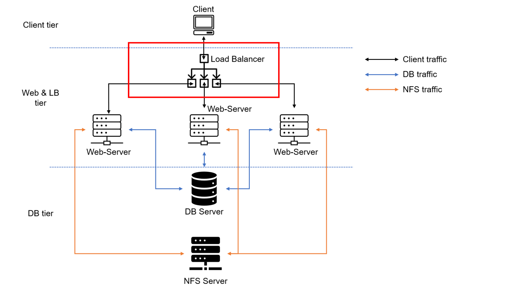
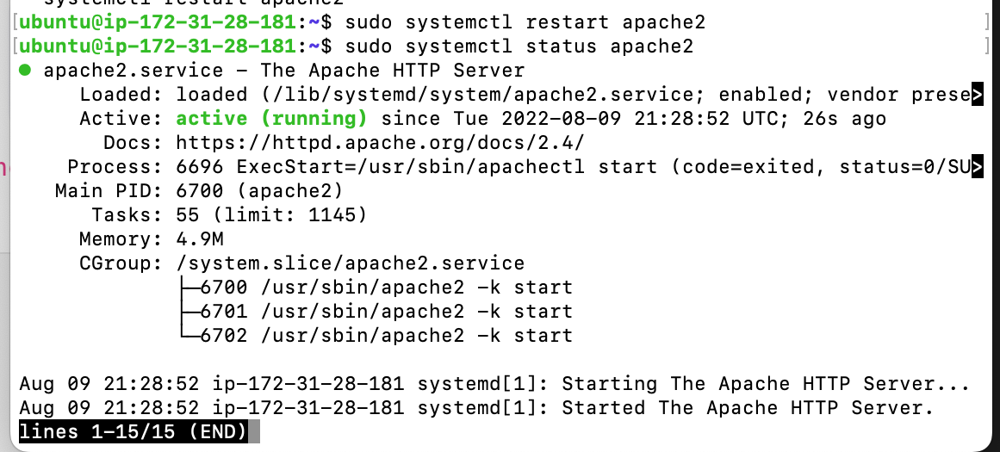
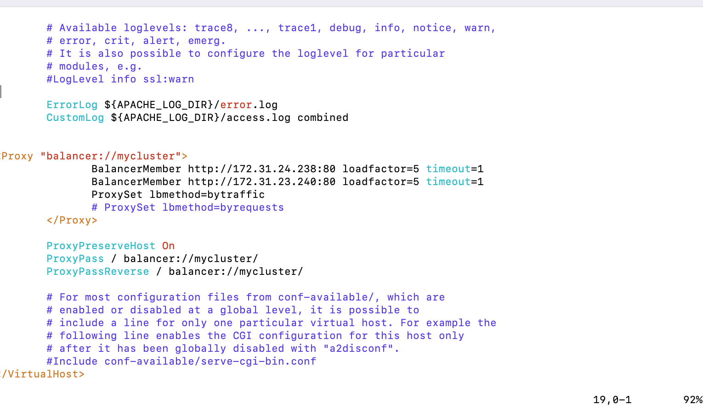
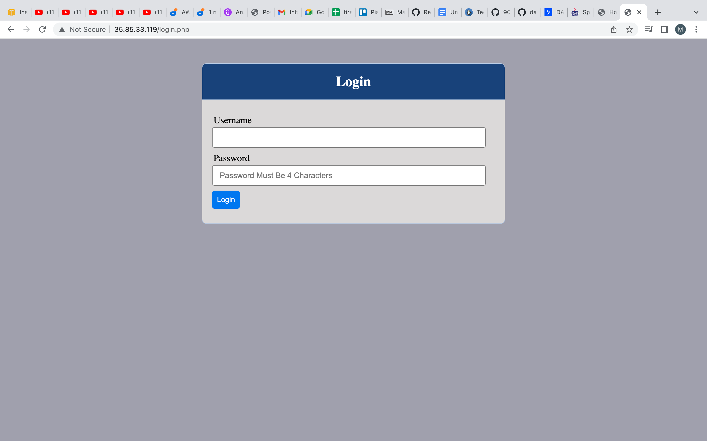
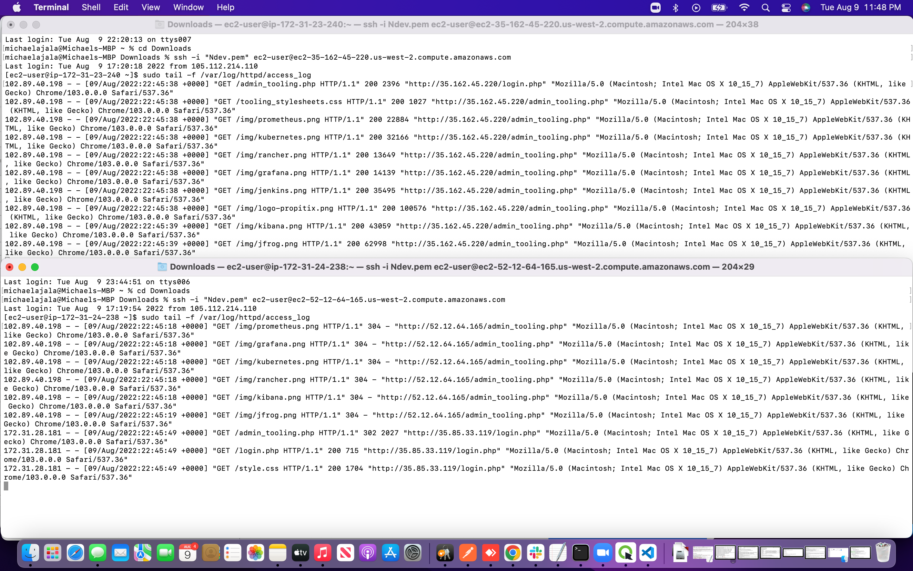

# LOAD BALANCER SOLUTION WITH APACHE

- The purpose of this project is to enhance our Tooling Website solution by adding a Load Balancer to distribute traffic between Web Servers and allow users to access our website using a single URL.

- From project 7 we had 3 Web Servers and each of them had its own public IP address and public DNS name. A client has to access them by using different URLs, which is not a nice user experience to remember addresses/names of even 3 server, let alone millions of Google servers.

- In order to hide all this complexity and to have a single point of access with a single public IP address/name, a Load Balancer can be used. A Load Balancer (LB) distributes clients’ requests among underlying Web Servers and makes sure that the load is distributed in an optimal way.



*the image above shows a 3-tier Web Application Architecture with a single Database, an NFS  Server as a shared files storage + Lod Balancer*

## CONFIGURE APACHE AS A LOAD BALANCER

- Created an Ubuntu Server 20.04 EC2 instance and named it Project-8-apache-lb

- Opened TCP port 80 by creating an Inbound Rule in the Security Group.

- Installed Apache Load Balancer on Project-8-apache-lb server and configured it to point traffic coming to LB to both Web Servers:

```
#Install apache2
sudo apt update
sudo apt install apache2 -y
sudo apt-get install libxml2-dev

#Enable following modules:
sudo a2enmod rewrite
sudo a2enmod proxy
sudo a2enmod proxy_balancer
sudo a2enmod proxy_http
sudo a2enmod headers
sudo a2enmod lbmethod_bytraffic

#Restart apache2 service
sudo systemctl restart apache2
```

- Confirmed that apache2 is up and running

```
sudo systemctl status apache2
```




### Load balancing configuration

- edited apache2 default config. file
```
sudo vi /etc/apache2/sites-available/000-default.conf
```
and inputed

```
<Proxy "balancer://mycluster">
               BalancerMember http://<WebServer1-Private-IP-Address>:80 loadfactor=5 timeout=1
               BalancerMember http://<WebServer2-Private-IP-Address>:80 loadfactor=5 timeout=1
               ProxySet lbmethod=bytraffic
               # ProxySet lbmethod=byrequests
        </Proxy>

        ProxyPreserveHost On
        ProxyPass / balancer://mycluster/
        ProxyPassReverse / balancer://mycluster/
```



- Restarted apache server

```
sudo systemctl restart apache2
```

- Verified the configuration if it is working by accessing the load balancer public Ip address



- /var/log/httpd/ was unmounted from the Web Servers to the NFS Server 

```
sudo umount -f /var/log/httpd
```
and made sure the Web Server has its own log directory.



*the image above shows the access log of both webservers*